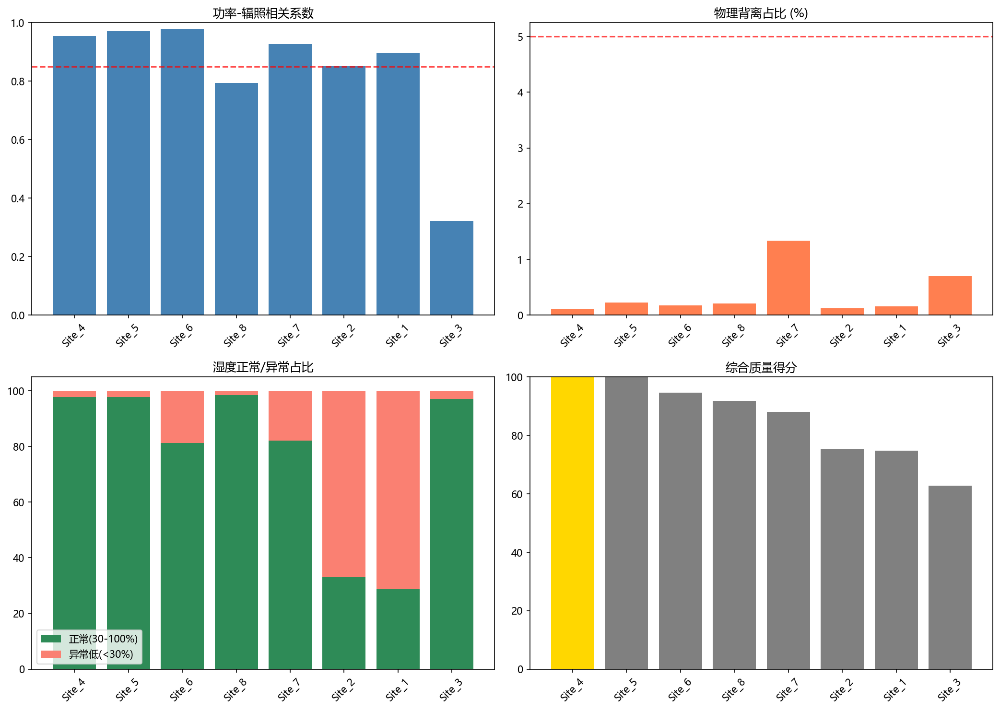

# Site 1–8 数据质量对比报告

**湿度正常标准（更苛刻）：30% – 100%**

## 综合排名

| 排名 | 站点 | 容量(MW) | 综合得分 | 功率-辐照r | 背离% | 正常湿度% | 异常低湿% | 功率合格 | 湿度合格 | 双项合格 |
|------|------|----------|----------|------------|-------|-----------|-----------|----------|----------|----------|
| 1 | Site_4 | 130 | **103.5** | 0.955 | 0.10 | 97.7 | 2.3 | 是 | 是 | 是 |
| 2 | Site_5 | 110 | **102.9** | 0.970 | 0.22 | 97.8 | 2.2 | 是 | 是 | 是 |
| 3 | Site_6 | 35 | **94.6** | 0.978 | 0.17 | 81.2 | 18.8 | 是 | 否 | 否 |
| 4 | Site_8 | 30 | **91.9** | 0.795 | 0.21 | 98.4 | 1.6 | 否 | 否 | 否 |
| 5 | Site_7 | 30 | **88.0** | 0.927 | 1.34 | 82.1 | 17.9 | 是 | 否 | 否 |
| 6 | Site_2 | 130 | **75.3** | 0.852 | 0.12 | 33.1 | 66.9 | 是 | 否 | 否 |
| 7 | Site_1 | 50 | **74.7** | 0.897 | 0.15 | 28.6 | 71.4 | 是 | 否 | 否 |
| 8 | Site_3 | 30 | **62.8** | 0.321 | 0.70 | 97.1 | 2.9 | 否 | 是 | 否 |

## 结论：质量最高站点为 **Site_4**（130 MW）

- 综合得分：**103.5/100**
- 功率-辐照 r = 0.9552，物理背离 0.10%
- 正常湿度占比 97.7%，异常低湿 2.3%

## 决策建议

1. **优先选用**：Site_4, Site_5（功率与湿度双项合格）
2. **综合质量最高**：Site_4，适合作为功率预测主训练集。
3. 对异常低湿占比高的站点，建模时移除或替换湿度特征（如 WRF 再分析）。
4. 剔除各站低相关日（r<0.6）后再进入 EXP-P01 后续流程。

## 湿度判定标准（本次采用）

- 正常：30% – 100%
- 异常低湿：< 30%
- 无效：超出 [0, 100]
- 合格阈值：正常占比 ≥ 60%，异常低湿 ≤ 20%，无效值 ≤ 1%，黏滞段 ≤ 50
