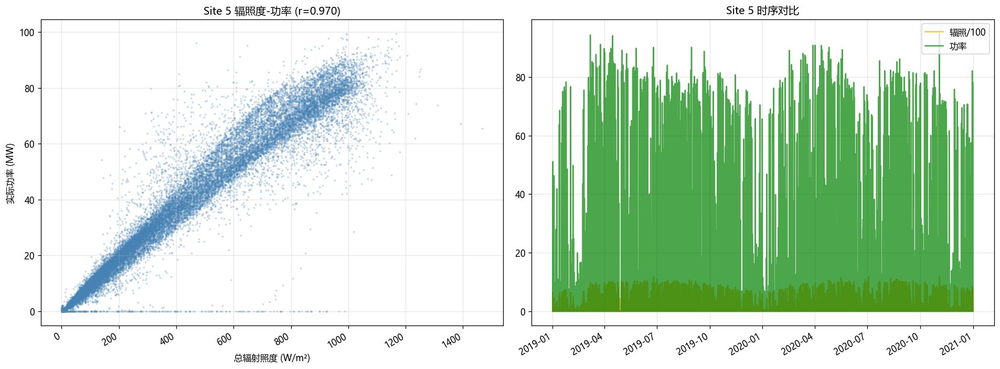
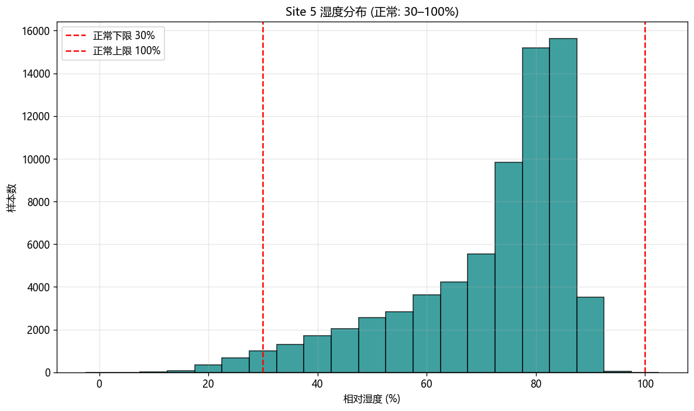

# Site_5 数据质量评估报告

## 数据概览

| 项目 | 值 |
|------|-----|
| 样本总数 | 70,176 |
| 时间范围 | 2019-01-01 00:00:00 ~ 2020-12-31 23:45:00 |
| 额定容量 | 110.0 MW |

## 任务一：辐照度-功率

| 指标 | 值 |
|------|-----|
| 全样本相关系数 r | 0.9702 |
| 白天段 r (辐照>50) | 0.9597 |
| 高辐照段 r (辐照>200) | 0.9132 |
| 逐日相关系数中位数 | 0.9917 |
| 物理背离样本 | 155 (0.22%) |
| 低相关日 (r<0.6) | 6 天 (0.8%) |
| 功率指标判定 | 合格 |

## 任务二：湿度（正常范围 30%–100%）

| 指标 | 值 |
|------|-----|
| 最小值 | 0.00% |
| 最大值 | 93.20% |
| 均值 | 71.60% |
| 中位数 | 77.20% |
| 正常湿度 (30–100%) | 68,601 (97.76%) |
| 异常低湿 (<30%) | 1,575 (2.24%) |
| 无效值 (超出0–100) | 0 (0.00%) |
| 低湿黏滞段 (<30%, ≥6h) | 20 |
| 高湿黏滞段 (>95%, ≥6h) | 0 |
| 湿度指标判定 | 合格 |

## 综合结论：**合格**（综合得分 102.9/100）
