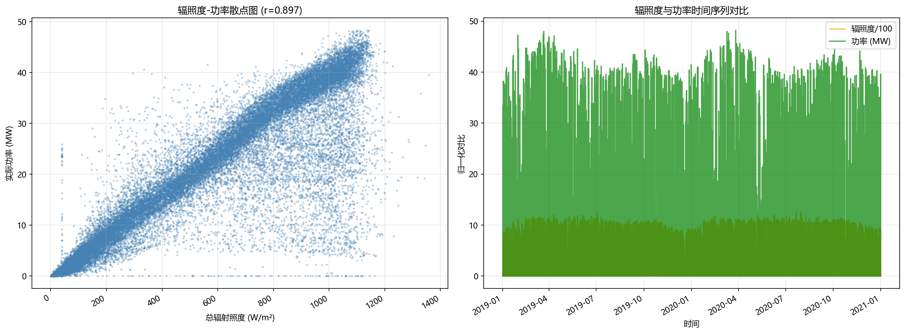
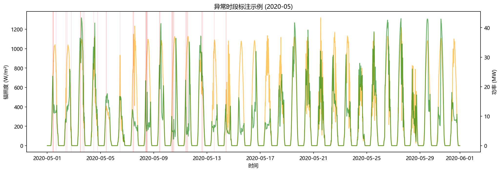
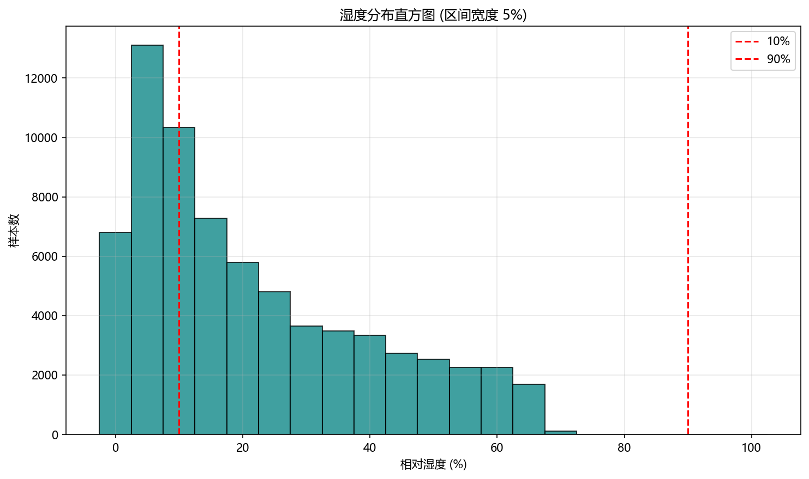

# Site 1 数据质量评估报告

## 数据概览

| 项目 | 值 |
|------|-----|
| 数据来源 | preprocessed_observed |
| 样本总数 | 70,176 |
| 时间范围 | 2019-01-01 00:00:00 ~ 2020-12-31 23:45:00 |
| 额定容量 | 50.0 MW |
| 关键字段 | `total_irradiance_wm2`（总辐射照度）, `power_mw`（实际功率）, `relative_humidity_pct`（相对湿度） |
| 采样频率 | 约 15 分钟（对齐后） |

## 任务一：辐照度-功率物理一致性

### 全样本 Pearson 相关系数: **0.8968**

### 物理背离样本统计

| 指标 | 值 |
|------|-----|
| 判定条件 | 辐照度 > 200.0 W/m² 且 功率 ≤ 2.5 MW（额定 5%） |
| 背离样本数 | 108 |
| 占总样本比例 | 0.15% |

### 相关系数 < 0.6 的逐小时时段（共 1650 个）

| 时段起始 | 时段结束 | 样本数 | 相关系数 |
|----------|----------|--------|----------|
| 2019-01-01 13:00:00 | 2019-01-01 14:00:00 | 4 | 0.561 |
| 2019-01-06 14:00:00 | 2019-01-06 15:00:00 | 4 | 0.598 |
| 2019-01-08 16:00:00 | 2019-01-08 17:00:00 | 4 | 0.484 |
| 2019-01-09 11:00:00 | 2019-01-09 12:00:00 | 4 | -0.663 |
| 2019-01-09 12:00:00 | 2019-01-09 13:00:00 | 4 | -0.994 |
| 2019-01-09 15:00:00 | 2019-01-09 16:00:00 | 4 | -0.995 |
| 2019-01-14 14:00:00 | 2019-01-14 15:00:00 | 4 | 0.568 |
| 2019-01-15 11:00:00 | 2019-01-15 12:00:00 | 4 | 0.547 |
| 2019-01-15 14:00:00 | 2019-01-15 15:00:00 | 4 | 0.245 |
| 2019-01-16 13:00:00 | 2019-01-16 14:00:00 | 4 | 0.002 |
| 2019-01-16 16:00:00 | 2019-01-16 17:00:00 | 4 | 0.509 |
| 2019-01-17 12:00:00 | 2019-01-17 13:00:00 | 4 | 0.320 |
| 2019-01-17 14:00:00 | 2019-01-17 15:00:00 | 4 | 0.352 |
| 2019-01-19 10:00:00 | 2019-01-19 11:00:00 | 4 | 0.570 |
| 2019-01-19 13:00:00 | 2019-01-19 14:00:00 | 4 | -0.122 |
| 2019-01-22 13:00:00 | 2019-01-22 14:00:00 | 4 | -0.994 |
| 2019-01-22 14:00:00 | 2019-01-22 15:00:00 | 4 | -0.614 |
| 2019-01-23 13:00:00 | 2019-01-23 14:00:00 | 4 | 0.507 |
| 2019-01-23 14:00:00 | 2019-01-23 15:00:00 | 4 | 0.269 |
| 2019-01-26 10:00:00 | 2019-01-26 11:00:00 | 4 | 0.563 |
| 2019-01-26 12:00:00 | 2019-01-26 13:00:00 | 4 | 0.354 |
| 2019-01-27 12:00:00 | 2019-01-27 13:00:00 | 4 | -0.705 |
| 2019-01-27 13:00:00 | 2019-01-27 14:00:00 | 4 | -0.606 |
| 2019-01-27 14:00:00 | 2019-01-27 15:00:00 | 4 | -0.463 |
| 2019-01-27 15:00:00 | 2019-01-27 16:00:00 | 4 | -0.769 |
| 2019-01-27 16:00:00 | 2019-01-27 17:00:00 | 4 | -0.508 |
| 2019-01-28 12:00:00 | 2019-01-28 13:00:00 | 4 | 0.421 |
| 2019-01-29 11:00:00 | 2019-01-29 12:00:00 | 4 | 0.440 |
| 2019-01-29 14:00:00 | 2019-01-29 15:00:00 | 4 | 0.226 |
| 2019-01-29 16:00:00 | 2019-01-29 17:00:00 | 4 | 0.376 |
| ... | 另有 1620 个时段见 low_corr_hourly.csv | | |

### 相关系数 < 0.6 的逐日时段（共 30 天）

| 日期 | 样本数 | 相关系数 |
|------|--------|----------|
| 2019-02-06 | 41 | 0.505 |
| 2019-02-07 | 42 | 0.531 |
| 2019-09-19 | 49 | 0.456 |
| 2019-09-30 | 48 | 0.203 |
| 2019-12-30 | 38 | 0.433 |
| 2020-02-09 | 42 | 0.333 |
| 2020-02-10 | 43 | 0.560 |
| 2020-02-13 | 43 | 0.213 |
| 2020-02-14 | 43 | -0.044 |
| 2020-02-15 | 43 | 0.170 |
| 2020-02-21 | 44 | 0.399 |
| 2020-02-23 | 44 | 0.372 |
| 2020-05-08 | 57 | 0.301 |
| 2020-05-10 | 58 | 0.203 |
| 2020-05-11 | 58 | 0.197 |
| 2020-05-13 | 57 | 0.415 |
| 2020-05-14 | 58 | 0.257 |
| 2020-05-15 | 58 | 0.237 |
| 2020-05-16 | 58 | 0.465 |
| 2020-05-17 | 58 | 0.462 |
| 2020-05-31 | 60 | 0.575 |
| 2020-10-25 | 43 | 0.342 |
| 2020-10-27 | 42 | 0.575 |
| 2020-10-30 | 42 | 0.438 |
| 2020-10-31 | 42 | 0.264 |
| 2020-11-04 | 42 | 0.430 |
| 2020-11-05 | 41 | 0.220 |
| 2020-11-06 | 42 | 0.400 |
| 2020-11-10 | 40 | 0.573 |
| 2020-11-15 | 40 | 0.235 |

### 异常时段检测（共 1,619 个时间点）

类型分布：

- 功率随辐照度上升而下降: 1,365
- 辐照度稳定但功率大幅波动: 254

## 任务二：湿度数据合理性

### 描述性统计

| 统计量 | 值 (%) |
|--------|--------|
| 最小值 | 0.00 |
| 最大值 | 69.90 |
| 均值 | 21.44 |
| 中位数 | 15.60 |
| 标准差 | 18.18 |
| 25%分位 | 6.50 |
| 75%分位 | 33.70 |

### 异常值统计

| 类型 | 数量 | 占比 |
|------|------|------|
| 超出 [0,100] 无效值 | 0 | 0.00% |
| 极端高湿 (>90%) | 0 | 0.00% |
| 极端低湿 (<10%) | 25,315 | 36.07% |

### 黏滞时段（连续 ≥6 小时 RH>95% 或 <5%，共 227 段）

| 起始 | 结束 | 时长(h) | 类型 | 平均RH |
|------|------|---------|------|--------|
| 2019-03-02 11:00:00 | 2019-03-02 21:45:00 | 10.8 | 低湿黏滞(<5%) | 2.2 |
| 2019-03-03 11:45:00 | 2019-03-03 19:00:00 | 7.2 | 低湿黏滞(<5%) | 3.4 |
| 2019-03-06 12:30:00 | 2019-03-06 20:00:00 | 7.5 | 低湿黏滞(<5%) | 3.3 |
| 2019-03-11 15:15:00 | 2019-03-11 21:15:00 | 6.0 | 低湿黏滞(<5%) | 3.8 |
| 2019-03-16 16:15:00 | 2019-03-17 00:30:00 | 8.2 | 低湿黏滞(<5%) | 2.4 |
| 2019-03-17 11:45:00 | 2019-03-17 22:30:00 | 10.8 | 低湿黏滞(<5%) | 1.8 |
| 2019-03-18 11:15:00 | 2019-03-18 21:30:00 | 10.2 | 低湿黏滞(<5%) | 2.3 |
| 2019-03-20 11:30:00 | 2019-03-21 00:45:00 | 13.2 | 低湿黏滞(<5%) | 2.0 |
| 2019-03-22 20:00:00 | 2019-03-23 03:30:00 | 7.5 | 低湿黏滞(<5%) | 1.9 |
| 2019-03-23 20:00:00 | 2019-03-24 04:15:00 | 8.2 | 低湿黏滞(<5%) | 2.2 |
| 2019-03-24 16:15:00 | 2019-03-25 00:45:00 | 8.5 | 低湿黏滞(<5%) | 2.5 |
| 2019-03-25 16:15:00 | 2019-03-25 23:00:00 | 6.8 | 低湿黏滞(<5%) | 2.2 |
| 2019-03-28 13:30:00 | 2019-03-28 22:00:00 | 8.5 | 低湿黏滞(<5%) | 1.7 |
| 2019-04-01 11:00:00 | 2019-04-02 02:00:00 | 15.0 | 低湿黏滞(<5%) | 2.4 |
| 2019-04-02 09:45:00 | 2019-04-02 23:00:00 | 13.2 | 低湿黏滞(<5%) | 1.6 |
| 2019-04-03 09:45:00 | 2019-04-03 23:45:00 | 14.0 | 低湿黏滞(<5%) | 1.5 |
| 2019-04-04 10:15:00 | 2019-04-04 22:15:00 | 12.0 | 低湿黏滞(<5%) | 1.7 |
| 2019-04-10 13:45:00 | 2019-04-11 00:00:00 | 10.2 | 低湿黏滞(<5%) | 2.0 |
| 2019-04-13 08:00:00 | 2019-04-14 01:00:00 | 17.0 | 低湿黏滞(<5%) | 1.8 |
| 2019-04-16 08:45:00 | 2019-04-16 21:00:00 | 12.2 | 低湿黏滞(<5%) | 1.4 |
| 2019-04-17 14:45:00 | 2019-04-18 00:00:00 | 9.2 | 低湿黏滞(<5%) | 1.8 |
| 2019-04-18 12:45:00 | 2019-04-19 05:00:00 | 16.2 | 低湿黏滞(<5%) | 3.2 |
| 2019-04-19 10:30:00 | 2019-04-19 21:30:00 | 11.0 | 低湿黏滞(<5%) | 1.9 |
| 2019-04-20 13:00:00 | 2019-04-20 19:45:00 | 6.8 | 低湿黏滞(<5%) | 3.6 |
| 2019-04-25 13:45:00 | 2019-04-25 22:45:00 | 9.0 | 低湿黏滞(<5%) | 2.1 |
| 2019-04-29 14:30:00 | 2019-04-30 03:00:00 | 12.5 | 低湿黏滞(<5%) | 3.4 |
| 2019-04-30 11:15:00 | 2019-05-01 00:30:00 | 13.2 | 低湿黏滞(<5%) | 2.2 |
| 2019-05-01 09:00:00 | 2019-05-01 16:45:00 | 7.8 | 低湿黏滞(<5%) | 1.9 |
| 2019-05-04 05:30:00 | 2019-05-04 12:00:00 | 6.5 | 低湿黏滞(<5%) | 2.0 |
| 2019-05-13 15:15:00 | 2019-05-13 23:30:00 | 8.2 | 低湿黏滞(<5%) | 1.3 |
| 2019-05-15 09:30:00 | 2019-05-15 20:45:00 | 11.2 | 低湿黏滞(<5%) | 3.1 |
| 2019-05-18 19:45:00 | 2019-05-19 02:00:00 | 6.2 | 低湿黏滞(<5%) | 3.0 |
| 2019-05-20 00:00:00 | 2019-05-20 11:15:00 | 11.2 | 低湿黏滞(<5%) | 1.9 |
| 2019-05-21 01:00:00 | 2019-05-21 09:15:00 | 8.2 | 低湿黏滞(<5%) | 1.0 |
| 2019-05-21 23:30:00 | 2019-05-22 09:45:00 | 10.2 | 低湿黏滞(<5%) | 1.2 |
| 2019-05-22 22:00:00 | 2019-05-23 09:15:00 | 11.2 | 低湿黏滞(<5%) | 2.2 |
| 2019-05-24 13:45:00 | 2019-05-24 21:15:00 | 7.5 | 低湿黏滞(<5%) | 3.4 |
| 2019-05-26 01:45:00 | 2019-05-26 10:15:00 | 8.5 | 低湿黏滞(<5%) | 1.3 |
| 2019-05-26 20:45:00 | 2019-05-27 02:45:00 | 6.0 | 低湿黏滞(<5%) | 1.5 |
| 2019-05-28 11:30:00 | 2019-05-28 22:30:00 | 11.0 | 低湿黏滞(<5%) | 2.1 |
| 2019-06-04 10:15:00 | 2019-06-05 01:00:00 | 14.8 | 低湿黏滞(<5%) | 1.8 |
| 2019-06-07 11:30:00 | 2019-06-07 20:00:00 | 8.5 | 低湿黏滞(<5%) | 2.8 |
| 2019-06-12 12:45:00 | 2019-06-12 22:15:00 | 9.5 | 低湿黏滞(<5%) | 2.1 |
| 2019-06-16 13:30:00 | 2019-06-16 22:45:00 | 9.2 | 低湿黏滞(<5%) | 1.8 |
| 2019-06-27 10:00:00 | 2019-06-27 16:15:00 | 6.2 | 低湿黏滞(<5%) | 2.3 |
| 2019-06-28 12:30:00 | 2019-06-28 23:45:00 | 11.2 | 低湿黏滞(<5%) | 1.7 |
| 2019-06-29 17:30:00 | 2019-06-30 02:15:00 | 8.8 | 低湿黏滞(<5%) | 1.7 |
| 2019-06-30 20:30:00 | 2019-07-01 04:00:00 | 7.5 | 低湿黏滞(<5%) | 2.0 |
| 2019-07-01 08:00:00 | 2019-07-01 21:00:00 | 13.0 | 低湿黏滞(<5%) | 1.6 |
| 2019-07-02 11:15:00 | 2019-07-03 00:45:00 | 13.5 | 低湿黏滞(<5%) | 2.0 |
| 2019-07-03 11:15:00 | 2019-07-04 00:15:00 | 13.0 | 低湿黏滞(<5%) | 1.8 |
| 2019-07-04 21:15:00 | 2019-07-05 03:45:00 | 6.5 | 低湿黏滞(<5%) | 1.5 |
| 2019-07-08 14:45:00 | 2019-07-08 21:30:00 | 6.8 | 低湿黏滞(<5%) | 3.3 |
| 2019-07-09 13:30:00 | 2019-07-09 23:30:00 | 10.0 | 低湿黏滞(<5%) | 1.5 |
| 2019-07-10 12:45:00 | 2019-07-10 21:00:00 | 8.2 | 低湿黏滞(<5%) | 1.1 |
| 2019-07-14 17:45:00 | 2019-07-14 23:45:00 | 6.0 | 低湿黏滞(<5%) | 3.0 |
| 2019-07-29 10:45:00 | 2019-07-29 22:45:00 | 12.0 | 低湿黏滞(<5%) | 2.6 |
| 2019-07-30 21:15:00 | 2019-07-31 12:00:00 | 14.8 | 低湿黏滞(<5%) | 1.8 |
| 2019-08-01 11:30:00 | 2019-08-01 19:45:00 | 8.2 | 低湿黏滞(<5%) | 2.6 |
| 2019-08-02 12:15:00 | 2019-08-02 21:15:00 | 9.0 | 低湿黏滞(<5%) | 1.6 |
| 2019-08-03 13:45:00 | 2019-08-03 22:00:00 | 8.2 | 低湿黏滞(<5%) | 0.9 |
| 2019-08-04 12:00:00 | 2019-08-04 22:45:00 | 10.8 | 低湿黏滞(<5%) | 1.8 |
| 2019-08-05 10:00:00 | 2019-08-05 20:30:00 | 10.5 | 低湿黏滞(<5%) | 1.5 |
| 2019-08-09 12:30:00 | 2019-08-10 00:45:00 | 12.2 | 低湿黏滞(<5%) | 1.7 |
| 2019-08-10 13:00:00 | 2019-08-10 19:45:00 | 6.8 | 低湿黏滞(<5%) | 4.0 |
| 2019-08-12 13:45:00 | 2019-08-12 19:45:00 | 6.0 | 低湿黏滞(<5%) | 2.7 |
| 2019-08-13 10:30:00 | 2019-08-13 19:45:00 | 9.2 | 低湿黏滞(<5%) | 1.7 |
| 2019-08-14 13:00:00 | 2019-08-14 19:45:00 | 6.8 | 低湿黏滞(<5%) | 4.0 |
| 2019-08-15 13:00:00 | 2019-08-15 19:45:00 | 6.8 | 低湿黏滞(<5%) | 4.0 |
| 2019-08-17 15:30:00 | 2019-08-18 02:00:00 | 10.5 | 低湿黏滞(<5%) | 4.0 |
| 2019-08-26 10:30:00 | 2019-08-26 19:30:00 | 9.0 | 低湿黏滞(<5%) | 2.7 |
| 2019-08-27 12:00:00 | 2019-08-27 20:15:00 | 8.2 | 低湿黏滞(<5%) | 3.4 |
| 2019-08-28 12:15:00 | 2019-08-28 23:15:00 | 11.0 | 低湿黏滞(<5%) | 2.2 |
| 2019-08-29 10:00:00 | 2019-08-30 04:00:00 | 18.0 | 低湿黏滞(<5%) | 2.0 |
| 2019-08-30 09:30:00 | 2019-08-30 19:45:00 | 10.2 | 低湿黏滞(<5%) | 2.7 |
| 2019-08-30 20:15:00 | 2019-08-31 07:15:00 | 11.0 | 低湿黏滞(<5%) | 2.2 |
| 2019-08-31 09:15:00 | 2019-08-31 19:45:00 | 10.5 | 低湿黏滞(<5%) | 2.9 |
| 2019-08-31 22:00:00 | 2019-09-01 05:15:00 | 7.2 | 低湿黏滞(<5%) | 1.6 |
| 2019-09-01 13:45:00 | 2019-09-02 01:00:00 | 11.2 | 低湿黏滞(<5%) | 3.5 |
| 2019-09-02 09:45:00 | 2019-09-02 23:45:00 | 14.0 | 低湿黏滞(<5%) | 1.7 |
| 2019-09-05 09:45:00 | 2019-09-05 20:30:00 | 10.8 | 低湿黏滞(<5%) | 2.2 |
| 2019-09-16 12:45:00 | 2019-09-16 21:15:00 | 8.5 | 低湿黏滞(<5%) | 1.8 |
| 2019-09-17 09:15:00 | 2019-09-18 02:15:00 | 17.0 | 低湿黏滞(<5%) | 1.3 |
| 2019-09-20 13:30:00 | 2019-09-20 19:30:00 | 6.0 | 低湿黏滞(<5%) | 3.9 |
| 2019-09-21 12:00:00 | 2019-09-21 20:00:00 | 8.0 | 低湿黏滞(<5%) | 3.1 |
| 2019-09-22 10:45:00 | 2019-09-22 21:15:00 | 10.5 | 低湿黏滞(<5%) | 1.8 |
| 2019-09-23 09:45:00 | 2019-09-23 22:30:00 | 12.8 | 低湿黏滞(<5%) | 2.0 |
| 2019-09-24 10:00:00 | 2019-09-25 00:15:00 | 14.2 | 低湿黏滞(<5%) | 2.7 |
| 2019-09-25 09:45:00 | 2019-09-25 22:30:00 | 12.8 | 低湿黏滞(<5%) | 2.3 |
| 2019-09-26 13:45:00 | 2019-09-26 23:30:00 | 9.8 | 低湿黏滞(<5%) | 2.3 |
| 2019-09-27 12:45:00 | 2019-09-27 19:30:00 | 6.8 | 低湿黏滞(<5%) | 1.4 |
| 2019-09-28 12:15:00 | 2019-09-28 19:30:00 | 7.2 | 低湿黏滞(<5%) | 3.3 |
| 2019-09-29 11:30:00 | 2019-09-29 19:45:00 | 8.2 | 低湿黏滞(<5%) | 3.4 |
| 2019-09-30 10:00:00 | 2019-09-30 21:00:00 | 11.0 | 低湿黏滞(<5%) | 2.0 |
| 2019-10-07 15:30:00 | 2019-10-07 21:45:00 | 6.2 | 低湿黏滞(<5%) | 2.7 |
| 2020-03-10 13:30:00 | 2020-03-10 19:30:00 | 6.0 | 低湿黏滞(<5%) | 3.6 |
| 2020-03-16 11:15:00 | 2020-03-16 22:30:00 | 11.2 | 低湿黏滞(<5%) | 1.9 |
| 2020-03-17 15:30:00 | 2020-03-17 23:30:00 | 8.0 | 低湿黏滞(<5%) | 1.8 |
| 2020-03-18 12:00:00 | 2020-03-18 22:00:00 | 10.0 | 低湿黏滞(<5%) | 2.8 |
| 2020-03-20 11:15:00 | 2020-03-20 20:15:00 | 9.0 | 低湿黏滞(<5%) | 2.6 |
| 2020-03-24 17:45:00 | 2020-03-25 06:15:00 | 12.5 | 低湿黏滞(<5%) | 1.9 |
| 2020-03-25 11:30:00 | 2020-03-25 20:30:00 | 9.0 | 低湿黏滞(<5%) | 2.5 |
| 2020-03-26 09:15:00 | 2020-03-27 12:30:00 | 27.2 | 低湿黏滞(<5%) | 2.1 |
| 2020-03-27 16:00:00 | 2020-03-28 00:45:00 | 8.8 | 低湿黏滞(<5%) | 2.1 |
| 2020-03-28 10:00:00 | 2020-03-29 00:00:00 | 14.0 | 低湿黏滞(<5%) | 2.3 |
| 2020-03-29 10:00:00 | 2020-03-29 21:45:00 | 11.8 | 低湿黏滞(<5%) | 1.8 |
| 2020-04-01 15:15:00 | 2020-04-01 22:45:00 | 7.5 | 低湿黏滞(<5%) | 3.6 |
| 2020-04-02 13:30:00 | 2020-04-03 02:00:00 | 12.5 | 低湿黏滞(<5%) | 2.3 |
| 2020-04-03 11:15:00 | 2020-04-03 22:15:00 | 11.0 | 低湿黏滞(<5%) | 3.0 |
| 2020-04-04 04:45:00 | 2020-04-05 04:15:00 | 23.5 | 低湿黏滞(<5%) | 2.0 |
| 2020-04-05 13:00:00 | 2020-04-06 03:15:00 | 14.2 | 低湿黏滞(<5%) | 2.6 |
| 2020-04-06 09:00:00 | 2020-04-06 23:00:00 | 14.0 | 低湿黏滞(<5%) | 1.8 |
| 2020-04-07 09:45:00 | 2020-04-08 01:30:00 | 15.8 | 低湿黏滞(<5%) | 2.2 |
| 2020-04-08 09:30:00 | 2020-04-09 00:00:00 | 14.5 | 低湿黏滞(<5%) | 1.0 |
| 2020-04-09 10:45:00 | 2020-04-10 01:30:00 | 14.8 | 低湿黏滞(<5%) | 2.9 |
| 2020-04-10 10:15:00 | 2020-04-10 22:15:00 | 12.0 | 低湿黏滞(<5%) | 3.4 |
| 2020-04-11 03:15:00 | 2020-04-11 09:30:00 | 6.2 | 低湿黏滞(<5%) | 0.2 |
| 2020-04-11 13:00:00 | 2020-04-11 22:15:00 | 9.2 | 低湿黏滞(<5%) | 4.1 |
| 2020-04-12 02:15:00 | 2020-04-12 10:00:00 | 7.8 | 低湿黏滞(<5%) | 0.9 |
| 2020-04-12 13:00:00 | 2020-04-12 22:15:00 | 9.2 | 低湿黏滞(<5%) | 4.1 |
| 2020-04-12 23:15:00 | 2020-04-13 11:15:00 | 12.0 | 低湿黏滞(<5%) | 1.8 |
| 2020-04-13 13:00:00 | 2020-04-14 04:30:00 | 15.5 | 低湿黏滞(<5%) | 3.3 |
| 2020-04-14 12:45:00 | 2020-04-14 19:30:00 | 6.8 | 低湿黏滞(<5%) | 1.5 |
| 2020-04-17 13:15:00 | 2020-04-17 21:00:00 | 7.8 | 低湿黏滞(<5%) | 2.9 |
| 2020-04-19 12:15:00 | 2020-04-19 22:15:00 | 10.0 | 低湿黏滞(<5%) | 2.2 |
| 2020-04-20 13:00:00 | 2020-04-21 02:15:00 | 13.2 | 低湿黏滞(<5%) | 2.4 |
| 2020-04-21 13:00:00 | 2020-04-22 03:45:00 | 14.8 | 低湿黏滞(<5%) | 2.9 |
| 2020-04-22 13:00:00 | 2020-04-23 09:45:00 | 20.8 | 低湿黏滞(<5%) | 1.9 |
| 2020-04-23 13:00:00 | 2020-04-23 22:15:00 | 9.2 | 低湿黏滞(<5%) | 4.1 |
| 2020-04-24 13:00:00 | 2020-04-24 22:15:00 | 9.2 | 低湿黏滞(<5%) | 4.1 |
| 2020-04-25 13:00:00 | 2020-04-25 22:15:00 | 9.2 | 低湿黏滞(<5%) | 4.1 |
| 2020-04-26 13:00:00 | 2020-04-26 22:15:00 | 9.2 | 低湿黏滞(<5%) | 4.1 |
| 2020-04-27 13:00:00 | 2020-04-27 22:15:00 | 9.2 | 低湿黏滞(<5%) | 4.1 |
| 2020-04-28 13:00:00 | 2020-04-28 22:15:00 | 9.2 | 低湿黏滞(<5%) | 4.1 |
| 2020-04-29 13:00:00 | 2020-04-29 22:15:00 | 9.2 | 低湿黏滞(<5%) | 4.1 |
| 2020-04-30 01:30:00 | 2020-04-30 09:15:00 | 7.8 | 低湿黏滞(<5%) | 1.0 |
| 2020-04-30 13:00:00 | 2020-04-30 22:15:00 | 9.2 | 低湿黏滞(<5%) | 4.1 |
| 2020-05-03 08:00:00 | 2020-05-03 18:00:00 | 10.0 | 低湿黏滞(<5%) | 1.1 |
| 2020-05-08 19:30:00 | 2020-05-09 09:30:00 | 14.0 | 低湿黏滞(<5%) | 2.0 |
| 2020-05-13 17:30:00 | 2020-05-13 23:45:00 | 6.2 | 低湿黏滞(<5%) | 2.1 |
| 2020-05-15 14:00:00 | 2020-05-15 23:00:00 | 9.0 | 低湿黏滞(<5%) | 2.2 |
| 2020-05-17 21:00:00 | 2020-05-18 05:30:00 | 8.5 | 低湿黏滞(<5%) | 2.1 |
| 2020-05-18 21:45:00 | 2020-05-19 10:45:00 | 13.0 | 低湿黏滞(<5%) | 1.6 |
| 2020-05-19 21:00:00 | 2020-05-20 03:15:00 | 6.2 | 低湿黏滞(<5%) | 2.3 |
| 2020-05-20 07:45:00 | 2020-05-20 16:45:00 | 9.0 | 低湿黏滞(<5%) | 2.9 |
| 2020-06-01 21:15:00 | 2020-06-02 05:00:00 | 7.8 | 低湿黏滞(<5%) | 2.2 |
| 2020-06-05 16:45:00 | 2020-06-05 23:45:00 | 7.0 | 低湿黏滞(<5%) | 1.5 |
| 2020-06-07 13:15:00 | 2020-06-07 21:30:00 | 8.2 | 低湿黏滞(<5%) | 1.7 |
| 2020-06-08 12:30:00 | 2020-06-08 22:15:00 | 9.8 | 低湿黏滞(<5%) | 1.9 |
| 2020-06-11 11:45:00 | 2020-06-11 20:45:00 | 9.0 | 低湿黏滞(<5%) | 2.9 |
| 2020-06-13 09:45:00 | 2020-06-13 17:15:00 | 7.5 | 低湿黏滞(<5%) | 1.7 |
| 2020-06-13 19:30:00 | 2020-06-14 01:30:00 | 6.0 | 低湿黏滞(<5%) | 1.9 |
| 2020-06-14 07:45:00 | 2020-06-15 01:45:00 | 18.0 | 低湿黏滞(<5%) | 1.3 |
| 2020-06-15 11:45:00 | 2020-06-15 20:45:00 | 9.0 | 低湿黏滞(<5%) | 2.0 |
| 2020-06-16 19:30:00 | 2020-06-17 02:15:00 | 6.8 | 低湿黏滞(<5%) | 2.2 |
| 2020-06-17 22:30:00 | 2020-06-18 04:45:00 | 6.2 | 低湿黏滞(<5%) | 1.6 |
| 2020-06-19 10:00:00 | 2020-06-19 20:15:00 | 10.2 | 低湿黏滞(<5%) | 1.6 |
| 2020-06-22 14:15:00 | 2020-06-23 00:15:00 | 10.0 | 低湿黏滞(<5%) | 2.4 |
| 2020-06-23 20:30:00 | 2020-06-24 10:30:00 | 14.0 | 低湿黏滞(<5%) | 1.9 |
| 2020-06-25 00:00:00 | 2020-06-25 06:30:00 | 6.5 | 低湿黏滞(<5%) | 1.2 |
| 2020-06-25 09:45:00 | 2020-06-25 22:45:00 | 13.0 | 低湿黏滞(<5%) | 1.2 |
| 2020-07-01 12:30:00 | 2020-07-01 23:45:00 | 11.2 | 低湿黏滞(<5%) | 1.1 |
| 2020-07-06 17:15:00 | 2020-07-06 23:15:00 | 6.0 | 低湿黏滞(<5%) | 2.3 |
| 2020-07-07 14:15:00 | 2020-07-07 21:00:00 | 6.8 | 低湿黏滞(<5%) | 1.4 |
| 2020-07-08 16:15:00 | 2020-07-08 22:15:00 | 6.0 | 低湿黏滞(<5%) | 1.7 |
| 2020-07-10 13:15:00 | 2020-07-10 19:30:00 | 6.2 | 低湿黏滞(<5%) | 2.9 |
| 2020-07-18 23:00:00 | 2020-07-19 06:30:00 | 7.5 | 低湿黏滞(<5%) | 1.5 |
| 2020-07-26 12:45:00 | 2020-07-26 21:30:00 | 8.8 | 低湿黏滞(<5%) | 2.6 |
| 2020-07-27 22:45:00 | 2020-07-28 07:45:00 | 9.0 | 低湿黏滞(<5%) | 0.9 |
| 2020-07-31 16:30:00 | 2020-08-01 00:45:00 | 8.2 | 低湿黏滞(<5%) | 1.8 |
| 2020-08-01 10:30:00 | 2020-08-01 19:45:00 | 9.2 | 低湿黏滞(<5%) | 3.1 |
| 2020-08-02 01:00:00 | 2020-08-02 19:45:00 | 18.8 | 低湿黏滞(<5%) | 2.5 |
| 2020-08-02 21:45:00 | 2020-08-03 10:45:00 | 13.0 | 低湿黏滞(<5%) | 1.9 |
| 2020-08-03 13:00:00 | 2020-08-03 19:45:00 | 6.8 | 低湿黏滞(<5%) | 4.0 |
| 2020-08-04 00:30:00 | 2020-08-04 06:30:00 | 6.0 | 低湿黏滞(<5%) | 1.9 |
| 2020-08-04 13:00:00 | 2020-08-04 19:45:00 | 6.8 | 低湿黏滞(<5%) | 4.0 |
| 2020-08-05 12:15:00 | 2020-08-05 22:00:00 | 9.8 | 低湿黏滞(<5%) | 2.5 |
| 2020-08-06 12:00:00 | 2020-08-06 19:45:00 | 7.8 | 低湿黏滞(<5%) | 2.4 |
| 2020-08-07 12:15:00 | 2020-08-08 00:30:00 | 12.2 | 低湿黏滞(<5%) | 1.5 |
| 2020-08-08 09:45:00 | 2020-08-08 19:45:00 | 10.0 | 低湿黏滞(<5%) | 2.4 |
| 2020-08-08 20:15:00 | 2020-08-09 02:45:00 | 6.5 | 低湿黏滞(<5%) | 2.3 |
| 2020-08-09 13:00:00 | 2020-08-10 16:00:00 | 27.0 | 低湿黏滞(<5%) | 2.0 |
| 2020-08-12 13:15:00 | 2020-08-12 20:30:00 | 7.2 | 低湿黏滞(<5%) | 2.5 |
| 2020-08-13 14:00:00 | 2020-08-13 22:15:00 | 8.2 | 低湿黏滞(<5%) | 3.3 |
| 2020-08-16 13:00:00 | 2020-08-16 20:30:00 | 7.5 | 低湿黏滞(<5%) | 3.2 |
| 2020-08-17 11:30:00 | 2020-08-17 19:45:00 | 8.2 | 低湿黏滞(<5%) | 2.8 |
| 2020-08-17 21:30:00 | 2020-08-18 04:00:00 | 6.5 | 低湿黏滞(<5%) | 2.1 |
| 2020-08-18 13:00:00 | 2020-08-18 19:45:00 | 6.8 | 低湿黏滞(<5%) | 4.0 |
| 2020-08-18 22:15:00 | 2020-08-19 05:00:00 | 6.8 | 低湿黏滞(<5%) | 1.1 |
| 2020-08-19 13:00:00 | 2020-08-19 21:00:00 | 8.0 | 低湿黏滞(<5%) | 3.2 |
| 2020-08-22 09:45:00 | 2020-08-22 20:45:00 | 11.0 | 低湿黏滞(<5%) | 2.1 |
| 2020-08-23 14:15:00 | 2020-08-23 21:30:00 | 7.2 | 低湿黏滞(<5%) | 1.7 |
| 2020-08-24 12:00:00 | 2020-08-24 21:15:00 | 9.2 | 低湿黏滞(<5%) | 2.0 |
| 2020-08-25 13:00:00 | 2020-08-26 00:45:00 | 11.8 | 低湿黏滞(<5%) | 2.9 |
| 2020-08-27 11:45:00 | 2020-08-27 19:45:00 | 8.0 | 低湿黏滞(<5%) | 3.2 |
| 2020-08-27 20:15:00 | 2020-08-28 05:45:00 | 9.5 | 低湿黏滞(<5%) | 2.3 |
| 2020-08-31 10:30:00 | 2020-08-31 22:45:00 | 12.2 | 低湿黏滞(<5%) | 1.8 |
| 2020-09-02 00:45:00 | 2020-09-02 09:15:00 | 8.5 | 低湿黏滞(<5%) | 1.6 |
| 2020-09-03 03:00:00 | 2020-09-03 10:00:00 | 7.0 | 低湿黏滞(<5%) | 0.8 |
| 2020-09-04 00:30:00 | 2020-09-04 10:00:00 | 9.5 | 低湿黏滞(<5%) | 0.5 |
| 2020-09-05 14:30:00 | 2020-09-05 21:15:00 | 6.8 | 低湿黏滞(<5%) | 2.9 |
| 2020-09-06 11:15:00 | 2020-09-06 19:30:00 | 8.2 | 低湿黏滞(<5%) | 3.0 |
| 2020-09-07 13:45:00 | 2020-09-07 20:15:00 | 6.5 | 低湿黏滞(<5%) | 2.8 |
| 2020-09-09 13:15:00 | 2020-09-09 21:30:00 | 8.2 | 低湿黏滞(<5%) | 2.3 |
| 2020-09-10 10:15:00 | 2020-09-10 17:45:00 | 7.5 | 低湿黏滞(<5%) | 1.7 |
| 2020-09-12 13:00:00 | 2020-09-12 21:00:00 | 8.0 | 低湿黏滞(<5%) | 1.1 |
| 2020-09-14 10:30:00 | 2020-09-15 00:45:00 | 14.2 | 低湿黏滞(<5%) | 2.1 |
| 2020-09-16 01:15:00 | 2020-09-16 10:00:00 | 8.8 | 低湿黏滞(<5%) | 1.7 |
| 2020-09-16 13:45:00 | 2020-09-16 23:15:00 | 9.5 | 低湿黏滞(<5%) | 1.3 |
| 2020-09-17 10:15:00 | 2020-09-17 19:30:00 | 9.2 | 低湿黏滞(<5%) | 2.6 |
| 2020-09-20 12:30:00 | 2020-09-20 21:30:00 | 9.0 | 低湿黏滞(<5%) | 2.3 |
| 2020-09-25 10:30:00 | 2020-09-25 16:45:00 | 6.2 | 低湿黏滞(<5%) | 1.4 |
| 2020-09-26 13:30:00 | 2020-09-27 00:45:00 | 11.2 | 低湿黏滞(<5%) | 1.2 |
| 2020-09-28 09:45:00 | 2020-09-28 20:15:00 | 10.5 | 低湿黏滞(<5%) | 1.9 |
| 2020-09-30 13:45:00 | 2020-09-30 20:45:00 | 7.0 | 低湿黏滞(<5%) | 1.8 |
| 2020-10-01 18:30:00 | 2020-10-02 00:45:00 | 6.2 | 低湿黏滞(<5%) | 1.9 |
| 2020-10-05 17:30:00 | 2020-10-06 00:15:00 | 6.8 | 低湿黏滞(<5%) | 2.0 |
| 2020-10-06 18:00:00 | 2020-10-07 00:45:00 | 6.8 | 低湿黏滞(<5%) | 2.4 |
| 2020-10-08 13:30:00 | 2020-10-09 00:00:00 | 10.5 | 低湿黏滞(<5%) | 1.4 |
| 2020-10-12 12:00:00 | 2020-10-12 19:30:00 | 7.5 | 低湿黏滞(<5%) | 2.3 |
| 2020-10-15 15:15:00 | 2020-10-15 21:45:00 | 6.5 | 低湿黏滞(<5%) | 2.7 |
| 2020-10-16 11:30:00 | 2020-10-16 21:45:00 | 10.2 | 低湿黏滞(<5%) | 2.3 |
| 2020-10-17 12:15:00 | 2020-10-17 18:15:00 | 6.0 | 低湿黏滞(<5%) | 3.8 |
| 2020-10-18 12:45:00 | 2020-10-18 22:00:00 | 9.2 | 低湿黏滞(<5%) | 2.6 |
| 2020-10-21 11:15:00 | 2020-10-21 21:45:00 | 10.5 | 低湿黏滞(<5%) | 2.5 |
| 2020-10-24 11:00:00 | 2020-10-24 19:15:00 | 8.2 | 低湿黏滞(<5%) | 1.0 |
| 2020-10-28 11:45:00 | 2020-10-28 19:15:00 | 7.5 | 低湿黏滞(<5%) | 1.8 |

## 综合结论

**总体判定：部分不合格（湿度数据显著异常）**

### 依据

1. **功率-辐照背离**：全样本 r=0.897（阈值 0.7），物理背离占比 0.15%（阈值 5%）→ 可接受。
2. **湿度异常**：无效值占比 0.00%（阈值 1%），极端值占比 36.07%（阈值 30%）→ 显著异常。

## 决策建议

**若功率一致性良好，可保留 Site 1 并剔除/修复湿度字段；否则建议更换；更换紧迫性：**中**。**

### 后续操作步骤

1. **立即**对其他场站（Site 2/4/5）执行相同质量检查；
2. 新数据集预筛选清单：
   - 辐照度字段完整率 ≥ 95%，且无大面积连续缺失；
   - 功率-辐照 Pearson r ≥ 0.85（白天段）；
   - 物理背离样本占比 ≤ 3%；
   - 湿度有效覆盖率 ≥ 98%，无效值 < 1%；
   - RH 主要分布集中在 30%–70%；
   - 采样频率稳定（15 min），时间戳无大量重复/乱序；
   - 额定容量元数据明确，功率单位一致。
3. 选定替代场站后，重复本报告流程并对比后再定训练集。