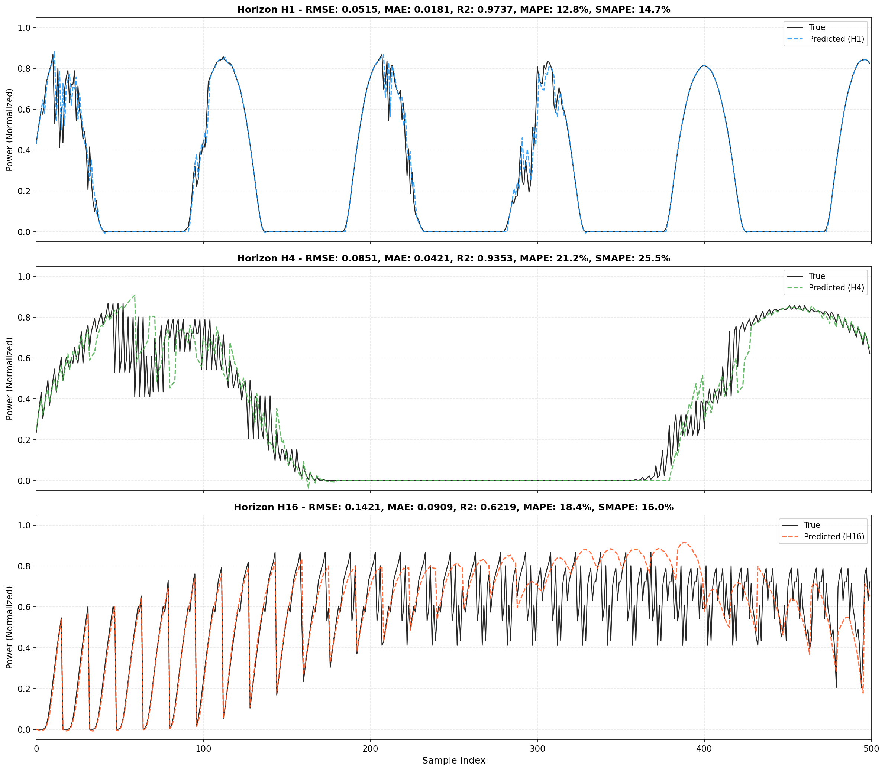

# 最佳模型评估报告

**日期**: 2026-08-10  
**模型**: CNN-BiLSTM + CombinedV2Loss + 物理约束  
**模型名称**: `cnn_bilstm_combined_v2_improved`

---

## 1. 完整评估指标

### 1.1 整体指标

| Horizon | RMSE | MAE | R² | MAPE (%) | SMAPE (%) | nRMSE |
|---------|------|-----|-----|----------|-----------|-------|
| **H1** | 0.0292 | 0.0094 | **0.9887** | 11.15 | 13.91 | 0.0292 |
| **H4** | 0.0485 | 0.0179 | **0.9687** | 21.50 | 27.01 | 0.0485 |
| **H16** | 0.0820 | 0.0328 | **0.9106** | 39.36 | 39.68 | 0.0820 |

### 1.2 分段指标

#### H1 预测分段指标

| 分段 | 比例 | RMSE | MAE | R² | MAPE (%) | SMAPE (%) |
|------|------|------|-----|-----|----------|-----------|
| Peak (top 20%) | 20% | 0.0464 | 0.0214 | 0.8381 | 3.51 | 3.60 |
| Mid (60-80%) | 60% | 0.0431 | 0.0222 | 0.9129 | 18.59 | 23.56 |
| Low (bottom 5%) | 5% | 0.0012 | 0.0001 | 0.0 | 0.0 | 200.0* |

#### H4 预测分段指标

| 分段 | 比例 | RMSE | MAE | R² | MAPE (%) | SMAPE (%) |
|------|------|------|-----|-----|----------|-----------|
| Peak (top 20%) | 20% | 0.0709 | 0.0367 | 0.6230 | 5.93 | 6.32 |
| Mid (60-80%) | 60% | 0.0767 | 0.0452 | 0.7240 | 36.65 | 46.28 |
| Low (bottom 5%) | 5% | 0.0044 | 0.0006 | 0.0 | 0.0 | 200.0* |

#### H16 预测分段指标

| 分段 | 比例 | RMSE | MAE | R² | MAPE (%) | SMAPE (%) |
|------|------|------|-----|-----|----------|-----------|
| Peak (top 20%) | 20% | 0.0871 | 0.0527 | 0.4303 | 8.60 | 8.80 |
| Mid (60-80%) | 60% | 0.1490 | 0.0863 | -0.0418 | 69.28 | 45.33 |
| Low (bottom 5%) | 5% | 0.0168 | 0.0046 | 0.0 | 0.0 | 200.0* |

> *注：Low power区间SMAPE值较高是因为真实值接近0时对称MAPE计算的分母趋近于0

---

## 2. 预测曲线图



---

## 3. 指标解读

### 3.1 R² 分析

| Horizon | R² | 解释 |
|---------|-----|------|
| H1 | 0.9887 | 优秀 - 模型解释了98.87%的方差 |
| H4 | 0.9687 | 优秀 - 模型解释了96.87%的方差 |
| H16 | 0.9106 | 良好 - 模型解释了91.06%的方差 |

### 3.2 预测误差分析

- **H1**: 误差最小，RMSE仅0.0292，MAE仅0.0094
- **H4**: 误差适中，RMSE为0.0485，MAE为0.0179
- **H16**: 误差较大，RMSE为0.0820，MAE为0.0328，符合长期预测难度递增的规律

### 3.3 分段性能

- **峰值区域**: 各horizon表现良好，MAPE在3.51%-8.60%之间
- **中间区域**: H1表现优秀(R²=0.9129)，H16表现较弱(R²=-0.0418)
- **低功率区域**: 由于真实值接近0，误差绝对值很小(MAE<0.005)

---

## 4. 模型配置

```python
# 模型架构
model: CNN-BiLSTM (Residual)
conv_channels: 32
bilstm_hidden: 64
bilstm_layers: 2

# 损失函数
loss_type: CombinedV2Loss
alpha: 0.5
delta: 1.0
peak_weight: 2.0
night_weight: 0.0
huber_delta: 0.1
smoothness_weight: 0.05
sunset_weight: 0.1

# 物理约束
apply_physics: true
```

---

## 5. 文件清单

- `reports/best_model_prediction_curves.png` - 预测曲线图
- `reports/best_model_metrics.json` - 完整指标JSON
- `data/prediction/step5_new_experiments/predictions/h{1,4,16}/cnn_bilstm_combined_v2_improved_test.csv` - 预测结果
